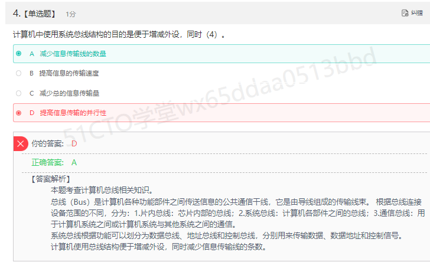
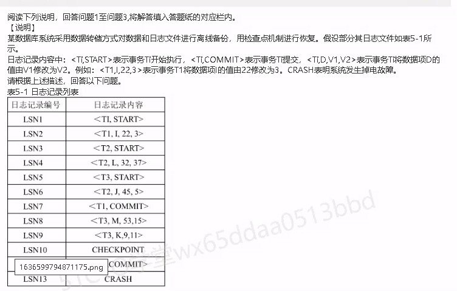
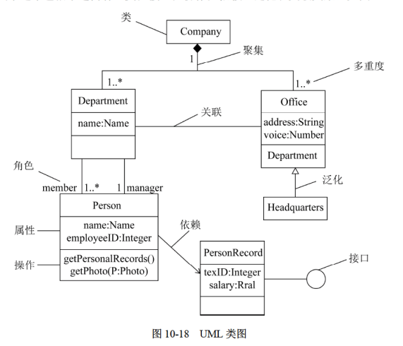
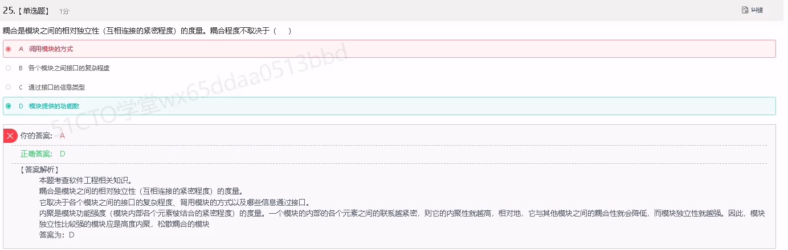
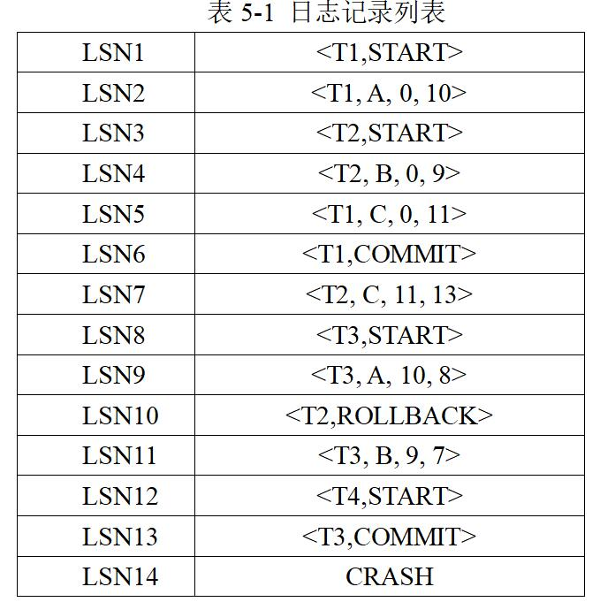

# 4月

## 4.4

# 2021（5.6）

> 61

## 

> 14

1. 

2. 团购点编号

   客户电话

   "供货"的供货商编号参考"蔬菜供应商"的供应商编号；"供货"的团购点编号参考"社区团购点"的团购点编号；"订单"的客户电话参考"客户"的客户电话；"订单"的团购点编号参考"社区团购点"的团购点编号

   > **答案**
   >
   > 

3. 

## 

> 10本来应该是满分15

1. 车牌号-》行驶路线；消毒人员工号-》消毒人员姓名；

   不符合2NF，因为存在部分函数依赖，例如车牌号能决定行驶路线，而主键又包含多项，这就造成了主键的部分可以决定非主键，违反了2NF的定义

2. 将消毒记录表分解为消毒记录表，车的行驶路线表，消毒人员信息表。消毒记录表主键为日期、车牌号和消毒人员工号的联合主键，外键有车牌号和消毒人员工号；车的行驶路线表主键有车牌号；消毒人员信息表主键有消毒人员工号

3. 在消毒记录表中添加消毒时间该属性即可

## 

> 12

1. player

   contest

   not null

   check (rank in ("一","二","三","四"))

   primary key(pno,cno)

2. player

   not in

   pno

   pc.cno=contest.cno

   and

   order

3. delete

   contest

   delete

   pc

## 

> 14

1. orders

   bno

   10000

   1

   commit;

2. after

   all_nums

   for each row

   new.all_nums

   old.all_nums

   bookorders

3. 498

   all_nums数据确实会出现不一致的问题，是读脏数据的问题

## 

> 11

1. I=3，J=5，k=9

2. redo：T2

   undo：T3

3. 先将数据库恢复到最近的一个检查点，再根据数据和日志文件做undo和redo的操作

   > **标准答案**
   >
   > 由于磁盘介质故障，必须用前期完全备份的副本和备份后的日志才能恢复到错误前的状态，步骤如下：
   >
   > 1. **加载**数据库**最近的完全备份文件**，把数据**恢复到备份时的状态**
   > 2. 加载备份后，通过**扫描**数据库运行时开启的**日志文件**，**把数据库恢复到系统出错误之前的状态**。本例中，**对**T1、T2做**redo**操作，T3做**undo**操作（因为T3全事务中都未提交）

# 2022（5.8）

## UML（5.8）

> **解题技巧：记一记+字面意思**
>
> unified modeling language统一建模语言

- （1）**类图**：类图描述一组**类、接口、协作和它们之间的关系。**

  > **主要用于对系统的静态设计视图建模**
  > **可以对逻辑数据库模式建模；对系统的词汇建模；对简单的协作建模**

  

- （2）**对象**图：**对象图描述一组对象及它们之间的关系**

  > **描述了类实例的静态快照。**

- （3）**用例**图：用例图描述一组用例、**参与者与它们之间的关系**

  

以下是**交互图（动态**方面的）

- （4）**序列图**：是场景的图形化表示，描述了以时间顺序组织的对象直接的交互活动，**它由一组对象或参与者以及它们之间可能发送的消息构成**。**交互图专注于系统的动态视图。序列图是场景的图形化表示，描述了以时间顺序组织的对象之间的交互活动，是强调消息的时间次序的交互图**

  

- （5）**通信图**：**它强调收发消息的对象或参与者的结构组织**。**序列图强调的是时序，通信图强调的是对象之间的组织结构（关系）。**

- （6）**状态图**：状态图描述一个状态机，**它由状态、转换事件和活动组成**。**状态图关注系统的动态视图。**

  > **用于接口、类和协作的行为建模（根据状态推出行为）**

  

- （7）**活动图**：活动图是一种特殊的状态图，它展现了在系统内**从一个活动到另一个活动的流程**。**活动图专注于系统的动态视图，它强调对象间的控制流程**

  > **用于系统的功能建模；强调控制流程**

**以下是静态模式**

- （8）**构件图：构件图描述一组构件之间的组织和依赖。构件图专注于系统的静态实现视图。它与类图相关，通常把构件映射为一个或多个类、接口或协作**
- （9）**部署图：部署图描述了运行时的处理节点以及其中的构件的配置。部署图给出了体系结构的静态实施视图。它与构件图相关，通常一个节点包含一个或多个构件**

## 

1. 

2. 医院名称

   接种日期

# 5.9

| TCP                      | UDP             |
| ------------------------ | --------------- |
| **ftp（20、21）**        | **tftp（69）**  |
| **pop3（110）**          | **dns（53）**   |
| **http（80）**           | **dhcp（67）**  |
| **smtp（25）、发送邮件** | **snmp（161）** |
| telnet（23）             | VOIP            |

> **中间三个一定要会默写**
>
> **用户通过键盘或鼠标**（也就是硬件）**进入某应用系统时**，**通常最先获得键盘和鼠标输入信息的是中断处理程序**

# 5.10

| 对称加密算法（带E：encrption） | 不对称加密算法                      |
| ------------------------------ | ----------------------------------- |
| **AES**                        | **RSA（三个人）、DSA**              |
| **DES**                        | Elgamal                             |
| **3DES**                       | EcC（圆曲线算法，用于比特币加密）、 |
| **RC系列**                     | 背包算法、Rabin、D-H等              |

信息摘要算法：

- **MD2**
- **MD4**
- **MD5：信息摘要算法**，**message-digest algorithm**，产生128位的输出
- **SHA-1：安全散列算法1**，**secure Hash Algorithm-1**，产生160位的输出，安全性更高

### 海明校验码

- 海明码：本质也是**利用奇偶性来检错和纠错**的检验方法，**构成方法实在数据位之间的确定位置上插入k个校验位，通过扩大码距实现检错和纠错**。

  > **设数据位是s位，校验位是j位，则s和j必须满足以下关系：2＾j-1＞＝s＋j
  > 2^校验位-1>=数据位+校验位**

# 5.11

| 聚类                 | 分类                          | 关联          |
| -------------------- | ----------------------------- | ------------- |
| **EM**               | **决策树decision trees**      | **Apriori**   |
| **K-means（K均值）** | C4.5                          | **FP-Growth** |
| **层次Hierarchical** | **SVM（支持向量机）**         |               |
| **DBSCAN基于密度**   | **朴素贝叶斯（naive bayes）** |               |
| 光谱聚类（spectral） | **随机森林random forests**    |               |

# 5.12

> **介质故障的恢复步骤**
>
> 1. **首先重新安装数据库管理系统**
> 2. **利用备份的xx文件（完整备份）恢复到数据准备后状态==加载数据库最近的完全备份文件xx，把数据恢复到备份时的状态**
> 3. **依次利用增量备份zz文件和系统日志文件yy进行恢复==通过扫描数据库运行时的日志文件，将数据库恢复到系统出错误前的状态，事务A、B做redo，事务C、D做undo**
>
> **怎么看介质故障里是redo还是undo？**
>
> 1. 该日志中**有提交**操作（commit）的事务，执行**REDO**
> 2. 该日志中**没有提交**操作的事务，执行**UNDO**

# 2020（5.13）

## 

1. 
2. 

## 

## 

## 

### 

1. cursor

   open

   **pprice**

   commit

2. 100和99

   不正确，属于丢失修改的错误

3. 两端锁协议就是为了防止用户数据不一致的操作，符合两段锁协议的事务称为可串行性的调度，可串行性的调度就是可以并发操作的调度。两端表示事务分为两个阶段，第一个阶段是加锁阶段，这个阶段不能进行解锁操作；另一个阶段是解锁阶段，这个阶段不能进行加锁操作。用了加锁操作表示进入加锁阶段，用了解锁操作表示进入解锁阶段。

   两段锁协议并不能避免死锁。保持事务的原子性、隔离性、持久性和一致性就是解决死锁的措施。

> **（1）两段锁协议是指对任何数据进行读写之前必须对数据加锁；在释放一个封锁之后，事务不再申请和获得任何其他锁。**
> **“两段”的含义是：事务分为两个阶段，第一阶段是获得封锁，称为扩展阶段；第二阶段是释放封锁，称为收缩阶段。**
> **（2）两段锁协议不能避免死锁。**
> **解决措施是采用死锁检测机制，发现后按照一定算法解除死锁。**

## 

1. 

2. 1

3. > **基于检查点的恢复过程**
   >
   > **步骤1：反向扫描日志文件，确定需要redo的事务和需要undo的事务。**
   > **步骤2：对需要undo的事务撤销已经执行的操作。**
   > **步骤3：对需要redo的事务重新执行已执行的操作。**

# 5.14

## 机制与无空置问题

若**查询结果为多条记录**时，将查询结果**交给主语言处理**时，应**使用**的机制是**游标**，**引入指示变量**来**解决主语言无空值**的问题

# 5.15

**如果有两个问你是否成功的问题，如果你真的不会或不熟悉，可以第一个答失败，第二个则是成功**

> **事务提交读隔离级别下，A事务和B事务是否成功结束？**
>
> 
>
> 不能成功，事务提交读隔离级别时，**A读取数据前要先加S锁，并到事务提交才释放S锁，而B事务写操作时，需要先加X锁，但此时无法加X锁**

> **数据库提供了多版本并发控制协议，两个事务是否成功结束？**
>
> 可以，**MVCC是一种多版本并发控制的方法，一般在数据库管理系统中，实现对数据库的并发访问。使用MVCC多版本并发控制比锁定模型的主要优点是在MVCC里，对检索（读）数据的锁要求与写数据的锁要求不冲突，所以读不会阻塞写，而写也从不阻塞读**

> **为什么先写日志机制更优？**
>
> 因为先写数据的话，一旦发生错误，那么故障前的commit就不会记录到。而要是先写日志，故障前的commit就会记录在内，就可以进行恢复操作

# 5.16

## 位示图的计算

> **xxx号物理块的在位势图中的__字中描述？**
>
> **用xxx号/系统字长位数(bit)**

> **磁盘容量xxG，物理块大小yyM，那么位示图大小为zz字？**
>
> **=磁盘容量xxG*1024\*yyM/系统字长位数(bit)**
>
> 

# 5.18（2024模考）

## **试题一（共15分）挺难的12**

阅读下列说明，回答问题1 至问题3，将解答填入答题纸的对应栏内。

【说明】

某电视台拟开发一套信息管理系统，以方便对全台的员工、栏目、广告和演播厅等进行管理。

【需求分析】

(1)系统需要维护全台员工的详细信息、栏目信息、广告信息和演播厅信息等。**员工**的信息主要包括：工号、姓名、性别、出生日期、电话和住址等，**栏目**信息主要包括：栏目名称、播出时间和时长等。**广告**信息主要包括：广告编号、价格等。**演播厅信息**包括：房间号、房间面积等。

(2)电视台根据调度单来协调各档栏目、演播厅和场务。一个销售档栏目只会占用一个演播厅，但会使用多名场务来进行演出协调。演播厅和场务可以被多个栏目循环使用。

(3)电视台根据栏目来插播广告。每档栏目可以插播多条广告，每条广告也可以在多档栏目中插播。

(4)一档栏目可以有多名主持人，但一名主持人只能主持一档栏目。

(5)一名编辑人员可以编辑多条广告，一条广告只能由一名编辑人员编辑。

【概念模型设计】

根据需求阶段收集的信息，设计的实体联系图（不完整）如图所示。

【逻辑结构设计】

根据概念模型设计阶段完成的实体联系图，得出如下关系模式(不完整)：

演播厅(房间号，房间面积)

栏目(栏目名称，播出时间，时长)

广告(广告编号，销售价格，___(1)___)

员工(工号，姓名，性别，出生日期，电话，住址)

主持人(主持人工号，___(2)___)

插播单(___(3)___，播出时间)

调度单(___(4)___)

【问题1】**5**

补充图中的联系和联系的类型。

【问题2】**2**

根据图，将逻辑结构设计阶段生成的关系模式中的空（1）~（4）补充完整。 用下划线指出（1）~（4）所在关系模式的主键。

演播厅(房间号，房间面积)

栏目(栏目名称，播出时间，时长)

广告(<u>广告编号</u>，销售价格，**员工工号**)

员工(工号，姓名，性别，出生日期，电话，住址)

主持人(<u>主持人工号</u>，__播出时间__)

插播单(<u>___广告编号___，播出时间</u>)

调度单(___<u>播出时间</u>___)

> **一个下划线可以有多个答案**

【问题3】**5**

现需要记录广告商信息，增加**广告商实体**。**一个广告商可以提供多条广告，一条广告只能由一个广告商提供**。请根据该要求，对图进行修改，**画出修改后的实体间联系和联系的类型**。

## 试题二（共15分）（难）4

阅读下列说明，冋答问题1至问题3,将解答填入答题纸的对应栏内。

【说明】

某图书馆的管理系统部分需求和设计结果描述如下：

图书馆的主要业务包括以下几项：

(1)对所有图书进行编目，每一**书目包括**ISBN号、书名、出版社、作者、排名，其中一部书可以有多名作者，每名作者有唯一的一个排名；

(2)对每本**图书进行编号，包括**书号、ISBN号、书名、出版社、破损情况、存放位置和定价，其中每一本书有唯一的编号，相同ISBN号的书集中存放，有相同的存储位置，相同ISBN号的书或因不同印刷批次而定价不同；

(3)读者向图书馆申请借阅资格，办理借书证，以后凭借书证从图书馆借阅图书。办理借书证时需登记身份证号、姓名、性别、出生年月日，并交纳指定金额的押金。**如果所借图书定价较高时，读者还须补交押金，还书后可退还所补交的押金；**

(4)读者**借阅图书前**，可以**通过ISBN号、书名或作者等单一条件或多条件组合进行查询**。根据查询结果，当有图书在库时，读者可直接借阅；当所查书目的所有图书己**被他人借走时，读者可进行预约，待他人还书后，由馆员进行电话通知；**

(5)读者借书时，由系统生成本次**借书的唯一流水号，并登记借书证号、书号、借书日期**，其中**同时借多本书使用同一流水号**，**每种书目都有一个允许一次借阅的借书时长，一般为90天**，不同书目有不同的借书时长，并且可以进行调整，但调整前所借出的书，仍按原借书时长进行处理；

(6)读者还书时，要登记还书日期，如果超出借书时长，要缴纳相应的罚款；如果所还图书由借书者在持有期间造成破损，也要进行登记并进行相应的罚款处罚。

初步设计的该图书馆管理系统，其关系模式如图4-1所示。

【问题1】**3**

对关系“借还”，请回答以下问题：

(1)列举出所有候选键；

流水号、借书证号和书号

(2)根据需求描述，借还关系能否实现对超出借书时长的情况进行正确判定？用60字以内文字简要叙述理由。如果不能,请给出修改后的关系模式（只修改相关关系模式属注时，仍使用原关系名，如需分解关系模式，请在原关系名后加1，2，…等进行区别)。

不能，因为不知道该书借了多长时间，只知道结束日期和换书日期的话，无法得知超出结束的市场。

修改后的借还关系：借还（流水号，借书证号，书号，借书日期，还书日期，罚款金额，罚款原因，借书时长）

【问题2】**0**

对关系“图书”，请回答以下问题：

(1)写出该关系的函数依赖集；

书号->书名，书号->出版社，书号->破损情况，书号->存放位置，书号->定价

(2)判定该关系是否属于BCNF，用60字以内文字简要叙述理由。如果不是，请进行修改，使其满足BCNF,如果需要修改其它关系模式，请一并修改，给出修改后的关系模式（只修改相关关系模式属性时，仍使用原关系名，如需分解关系模式，请在原关系名后加1，2，...进行区别）。

该关系属于BCNF，因为该关系不存在主属性对码的部分函数依赖与传递函数依赖。

【问题3】**1**

对关系“书目”，请回答以下问题：

(1)它是否属于第四范式，用60字以内文字叙述理由。

该关系不属于第四范式，因为针对同一个ISBN号，可以有多个基于同一个ISBN号的借书时长，因此不满足非主属性的非平凡多值依赖。

(2)如果不是，将其分解为第四范式，分解后的关系名依次为：书目1，书目2，…。 如果在解决【问题1】、【问题2】时，对该关系的属性进行了修改，请沿用修改后的属性。

书目1（<u>ISBN号</u>，书名，出版社，作者，排名）

书目2（<u>ISBN号</u>，借书时长）

## 试题三（共15分）11

阅读下列说明，回答问题1 至问题3 ，将解答填入答题纸的对应栏内。

【说明】

某大型集团公司的数据库的部分关系模式如下：

员工表：EMP（Eno,Ename，Age，Sex, Title)，各属性分别表示员工工号、姓名、年龄、性别和职称级别，其中性别取值为“男”“女”；

公司表：COMPANY(Cno，Cname，City)，各属性分别表示公司编号、名称和所在城市；

工作表：WORKS(Eno．Cno，Salary)，各属性分别表示职工工号、工作的公司编号和工资。

有关关系模式的属性及相关说明如下：

（1）允许一个员工在多家公司工作，使用身份证号作为工号值。

（2）工资不能低于1500元。

【问题1】**5**

请将下面创建工作关系的SQL语句的空缺部分补充完整，要求**指定关系的主码、外码，以及工资不能低于1500元的约束**。

CREATE TABLE WORKS(

Eno  CHAR(10) reference emp(eno)，

  Cno CHAR(4) reference company(cno)，

  Salary int check(salary>=1500)，

  PRIMARY KEY(eno,cno)

)；

【问题2】**3**

请将下面SQL语句的空缺部分补充完整。

（1）创建女员工信息的视图FemaleEMP．属性有Eno、Ename、Cno、Cname和Salary，请将下面SQL语句的空缺部分补充完整。

 CREATE view FemaleEMP

AS

   SELECT  EMP．Eno， Ename， COMPANY．Cno， Cname， Salary

FROM  EMP， COMPANY， WORKS

WHERE emp.eno=works.eno and company.cno=works.cno；

（2）员工的工资由职称级别的修改自动调整，需要用触发器来实现员工工资的自动维护，函数float Salary_value(char(10) Eno)依据员工号计算员工新的工资。请将下面SQL语句的空缺部分补充完整。

CREATE trigger Salary_TRG  AFTER update of title ON EMP

REFERENCING new row AS nrow

FOR EACH ROW

BEGIN

UPDATE WORKS

  SET salary=salary_value(nrow.eno)

  WHERE eno=nrow.eno；

END

【问题3】**3**

请将下面SQL语句的空缺部分补充完整。

（1）查询**员工最多的公司编号和公司名称**。

SELECT  COMPANY．Cno， Cname

FROM  COMPANY， WORKS

WHERE  COMPANY．Cno=WORKS．Cno

GROUP BY works.cno

HAVING max(count(*))>=all(SELECT  COUNT( * )FROM  WORKS GROUP BY Cno) ;

(2) 查询**所有不在“中国银行北京分行”工作的员工工号和姓名**。。

SELECT Eno， Ename

FROM  EMP

WHERE Eno not in (

  SELECT  Eno

FROM works,company

WHERE works.cno=company.cno

AND Cname='中国银行北京分行'  )；

## 试题四（共15分）13

阅读下列说明，回答问题1至问题3,将解答填入答题纸的对应栏内。

【说明】

某高速路不停车收费系统（ETC)的业务描述如下：

(1)车辆驶入高速路入口站点时，将驶入信息（ETC卡号，入口编号，驶入时间） 写入登记表；

(2)车辆驶出高速路出口站点（收费口）时，将驶出信息（ETC卡号，出口编号， 驶出时间）写入登记表；根据入口编号、出口编号及相关收费标准，清算应缴费用，并从绑定的信用卡中扣除费用。

【问题1】**3**

在不修改登记表的表结构和保留该表历史信息的前提下，**当车辆驶入时，如何保 证当前ETC卡已经清算过**，而在**驶出时又如何保证该卡已驶入而未驶出**？请用100 字以内文字简述处理方案。

第一种情况可以对登记表创建语句前行级触发器，在写入登记表前，先去查看登记表里该ETC卡是否已经清算过，若清算过才给予放行；第二种情况同理，在将驶出信息写入登记表前，先查看登记表里该ETC卡是否已有驶入记录。

【问题2】**5**

当车辆驶出收费口时，从绑定信用卡余额中扣除费用的伪指令如下：读取信用卡余额到变量X，记为x = R(A)；扣除费用指令x = x - a;写信用卡余额指令记为W(A, x)。

(1)当两个绑定到同一信用卡号的车辆同时经过收费口时，可能的指令执行序列为：x1=R(A)，x1 =x1-a1, x2 = R(A), x2 = x2-a2, W(A，x1，W(A，x2)。此时会出现什么问题？（100字以内）

可能会出现丢失修改的情况，就是其中一个车辆进行的扣费记录会被另一个车辆的扣费记录替换掉，也就是说，到最后，只有一辆车的扣费记录却有两辆车通行，造成了错误。

(2)为了解决上述问题，引入独占锁指令XLock(A)对数据A进行加锁，解锁指令Unlock(A)对数据A进行解锁。请补充上述执行序列，使其满足2PL协议。

XLock(A) ,x1=R(A)，x1 =x1-a1,W(A，x1),Unlock(A),XLock(A), x2 = R(A), x2 = x2-a2, W(A，x2),Unlock(A)

【问题3】**5**

下面是用E-SQL实现的费用扣除业务程序的一部分，请补全空缺处的代码。

CREATE PROCEDURE 扣除(IN ETC 卡号 VARCHAR(20),IN 费用 FLOAT)

BEGIN

UPDATE 信用卡 SET 余额=余额-费用

FROM信用卡,绑定

WHERE信用卡.信用卡号=绑定.信用卡号 AND  信用卡.信用卡号=etc卡号 ;

if error then ROLLBACK;

else commit ;

END

## 试题五（共15分）6

阅读下列说明，回答问题1和问题3，将解答填入答题纸的对应栏内。

【说明】

如果一个数据库系统采用数据库镜像备份机制进行数据库备份。

请根据上述描述，回答以下问题。

【问题1】（5分）**0**

如果当前主数据库系统遭遇到了不可修复的硬盘故障，整个数据库系统如何工作？

利用数据库镜像备份将数据库恢复到镜像时的状态，对故障发生前提交了的事务利用日志文件进行redo的操作，对故障发生前未进行提交的事务利用日志文件反向的执行undo操作

> **答案**
>
> 1. 由于是镜像数据库系统，因此当主数据库（A服务器）崩溃后，镜像数据库（B服务器）会自动转化为主数据的角色接管整个系统服务
>
> 2. 系统管理员对A服务器系统进行硬件维修，恢复后设置A服务器为镜像数据库系统，此时利用镜像数据库原理，该系统数据库会与B服务器里面的主数据库同步。
>
>    当然如果依然需要用A服务器做完主数据库，管理员进行设置即可

【问题2】（4分）**0**

如果日志文件如表5-1所示，第一列表示日志记录编号，第二列表示日志记录内容。<Ti,START>表示事务Ti开始执行，<Ti,COMMIT>表示事务Ti提交，<Ti, D, V1, V2>表示事务Ti将数据项D的值由V1修改为V2。

系统发生事务故障时，故障恢复有撤销事务（undo）和重做事务（redo）两个操作。请给出系统恢复时需要redo的事务列表和需要undo的事务列表？

redo：T1，T3

undo：T2，T4

> **rollback的也要算做redo里**

【问题3】（6分）**6**

在【问题2】中，假设系统开始执行前A=0，B=0，C=0，请问系统出现操作系统故障后，恢复后X，Y，Z各自的数值是多少？

8，7，11
